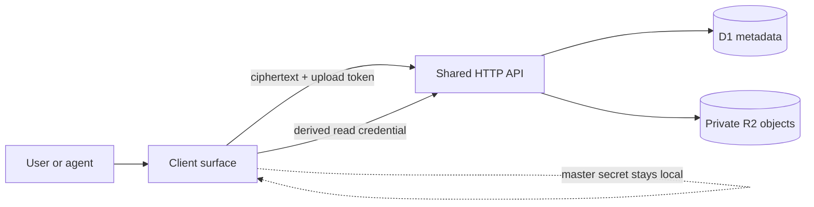
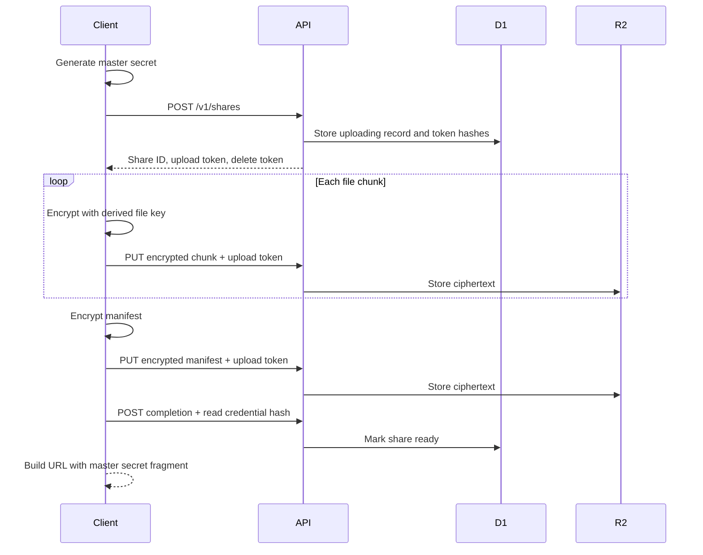

# Architecture

## System overview



The system has one protocol and API with multiple intended client surfaces. The web application is
the first surface. CLI and MCP integrations should compose `@share/client` rather than create a
second protocol.

The production deployment is one Cloudflare Worker. Static assets are served for application
routes, while `/v1/*` and `/health` execute the Worker first. The Worker uses D1 for share lifecycle
metadata and private R2 for encrypted manifests and chunks.

## Package responsibilities

### `@share/protocol`

Owns versioned wire types and validation:

- API request and response schemas
- Manifest schema and safe path rules
- Protocol version and cryptographic size constants

It contains no platform or UI code.

### `@share/crypto`

Owns cryptographic mechanics:

- random master secrets and per-file nonce prefixes
- HKDF-SHA-256 key derivation
- AES-256-GCM manifest and chunk operations
- base64url encoding and credential hashing

It knows the protocol context needed for authenticated data but does not perform network requests.

### `@share/client`

Owns surface-independent workflows:

- create a share
- encrypt and upload bounded chunks
- encrypt and upload the manifest
- derive authorization without exposing encryption keys
- unlock a manifest
- lazily fetch and decrypt a selected file
- delete a share

Browser, CLI, and MCP surfaces should adapt their files and progress reporting to these functions.

### `@share/server`

Owns application rules behind storage ports:

- share creation and lifecycle
- upload, read, and delete authorization
- secret hashing and constant-time comparison
- deterministic private object-key construction

It does not depend on Cloudflare APIs.

### Cloudflare API

`apps/api-cloudflare` connects the server ports to:

- Hono HTTP routes
- D1 metadata storage
- private R2 blob storage
- configured CORS policy
- Worker static assets

## Create flow



## Read flow

1. The client obtains the master secret from the fragment or direct user input.
2. It derives the read credential and manifest key.
3. The API validates the read credential before reading R2.
4. The client decrypts and validates the manifest locally.
5. Selecting a file fetches only that file's encrypted chunks.
6. The client authenticates and decrypts each chunk locally.

This authorization step prevents an unauthenticated link visitor from downloading even the
ciphertext. It does not give the server decryption ability.

## Stored data

### D1

D1 stores opaque identifiers, lifecycle state, protocol version, hashed authorization material,
counts, byte totals, creation/completion timestamps, and optional expiry. It does not store names or
paths.

### R2

Objects are private and namespaced under an opaque share ID:

```text
shares/<share-id>/manifest
shares/<share-id>/objects/<object-id>/chunks/<index>
```

Every stored body is ciphertext. Object IDs reveal no filename or path.

## Trust boundary

The API and storage providers are trusted for availability and deletion, but not confidentiality.
The hosted web bundle is inside the trust boundary because it executes client-side cryptography.
Independent clients can reduce reliance on the hosted bundle by implementing the documented
protocol.

See [protocol.md](protocol.md) for the exact key schedule and ciphertext format.
